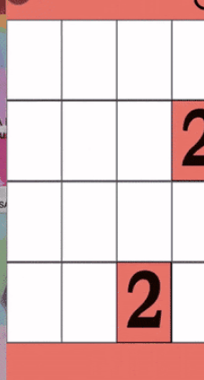

Game Center App
 =====================================================================================
 ## Sample Game Play ##

   

 ### Winning positions and scoreboards update ###

  
   

 
 ## SetUp Instructions ##
 ### Note that the app can also be   directly  downloaded as an `apk` file to be run in a compatible Android device.
 In order to successfully set up our project (in dev mode), the user should first `git clone` into an empty directory,
 And then, open android studio, choose "open another project", select the folder, click into the group file,
 and proceed to GameCenter folder, then open it. Run build on android studio, wait for a few minutes before the
 whole project is synced and built successfully. Then you can run this program via an emulator. 
 

 To set up and run unit test related to mock, please follow instruction in
 https://developer.android.com/training/testing/unit-testing/local-unit-tests

## Prerequisites ##
 This game is only designed to be run on Pixel 2 with API 27, as per the project setup instructions.
 Although, it is also possible for the game to be run on other specifications (such as a lower API
 version or a different-sized phone, please keep in mind there might be differences to the overall
 appearance and design due to incompatibility.)
 
## Description ##
To enter this game, the user has to 
 successfully register (or login to an existing account), which will then be directed to the game 
 center. There, the user can choose which games they would like to play by clicking/pressing onto
 the corresponding images (i.e. press the tiles image to enter "Sliding Tiles" game).In the game 
 center, the users can also access their personal profiles, which will display recent games played
  
 For the purpose of this app, a personal and global scoreboard, and a user profile has been
 implemented as well for each individual game, which could only be accessed upon a successful login 
 for each individual user. When a new user click on the "load saved game" for the first time before
 any past game is saved, a new game will be created automatically. Different game settings could
 also be customized for each individual game (i.e. changing the board complexity, or pre-defining a
 maximum number of undo moves that could be made per move for the "Sliding Tiles" game.

 For Phase 2, we have implemented the game 2048 and sudoku, which is could accessed by clicking on
 their respective image tiles in game center. Most functions of the sliding tiles game has been achieved
 including, but not limited to global scoreboard, load/save game, undo (for 2048 game), profile photo
 upload and winning/losing screen with the number of moves the user has taken.

 ## Tips ##
 * You could use the android built-in return/back button (usually located at the bottom for most android
 phones) to return to the previous page (or "activity").  
 
 * We'll have a scene counting your steps when you win this game!
  And, you can check successful implementation of functions after you win by easily commenting out
  all "Collections.shuffle(tiles);" in BoardManager.java, 

 * You cannot save/load game if there is no incomplete game in progress.

 * Upload your own image for the tile background every time you want one. Otherwise the program will use the default background.  
 If you want to test this on android studio, you can open "View -> tool windows -> Device File Explorer" and click it and then find "sdcard/DCIM", then right click the mouse, upload the picture in it.
 after opening the project and running it

 * Your undo chances of previous game after loading the game will be 0. (We think it is most likely that
 those chances of undoing will no longer exist since you cannot finish this game in one time and it's unfair for someone else who can do it in one time.)

 * The profile page will show the number of steps you got in your latest game. (whether it's
 complete or not). You can also upload your own photo by clicking on the profile button now.

 * Start a new game after completed one, or else (if you continue load saved game) your number of
 steps will increase, which is not wanted in this game.

 * Scores (on scoreboard) are calculated and ranked by the LEAST number of moves taken to win the
 give game.

 * Many utility class/methods are in helpers, so they are set to be static.

## Structure of Program ##
* We divided the program Component, Helper, users, Structure,  and View system (into four parts)  
* The users system control the distribution of data storage around users.
* The Component consists of necessary component to make a game such as tile
* The Structures module is the data structure we use to implement certain functionalities.
* The Helpers are functional tools to handle repeated procedure, so they're basically constant and static methods.  

* In the view System, we put some controller in it to make the system more maintainable, since some controller is quite small, such as the score system, and it's not worthy of making one since currently. In other words, we try to make a MVVM design to make the program more reliable. The dependencies of Views are straight forward, the view will contain some constant variables to help identify later effects while running.
 
## Authors ##
* Timothy Lee (git username: leetim13)
* Junxuan Wu 
* Quanzhou Li
* Yinling Luo

## Build With ##
 * Android Studio
 * Gradle

## Functions Implemented: ##
 * login & register *
 * undo & loadsave/autosave * (undo button is on the upper right corner when playing the tile game)
 * Choosing the max undo step and complexity of board to play with *
 * Individual user profile* (the new functionality we implemented!)
 * Game Center Created*
 * Score counter achieved* (compare number of steps to solve puzzle for same complexity, smaller step
                            means better)
 * upload user's own image to the background of tiles
 * 2048 game with scoreboard
 * sudoku game with scoreboard

## How We Sort Scores ##
 * We sort the scores according to the number of moves that a user made in a game after they win the game. If they managed to complete a game with fewer step, the number of their score will be smaller(since the score is the number of moves they made in a completed game) and the rank will be higher.

## Winning Condition Of Games ##
"slidingtile" sort the tiles in descending order

"2048" same rules as the 2048 game, but our version will terminate once the user hits the `2048` tile

"sudoku" same rules as the sudoku game

 ## License ##
This project is licensed under the MIT License
 
## Profile rendering ##
In our personal profile activity, the number of moves of last game will be recorded
only if the player makes one move in a game
